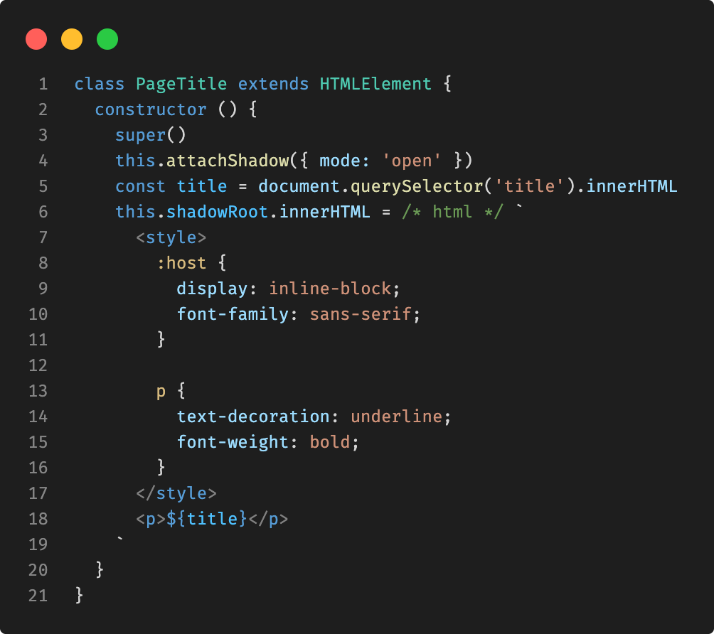

# Web Components by Example

**By Erik Gillespie**

An introduction to web components using lots of examples. Even the slides are written with web components! (so meta)

To experience this presention, visit:

[egillespie.github.io/web-component-intro](https://egillespie.github.io/web-component-intro)

## About the presenter

- Erik Gillespie

- My pronouns are he/him or they/them

- Email me at [`erik.gillespie@gmail.com`](mailto:erik.gillespie@gmail.com)

- I help out at Lansing Codes and Lansing Makers Network

- I teach web dev at MSU and homeschool my kiddo

- I love board games and a good book

## Helpful skills to know

I think it's easier to learn web components if you know a bit of:

- HTML

- Basic JavaScript syntax

- Accessing the DOM with JavaScript

- JavaScript classes

- A little CSS

## Web components defined

A browser API that allows custom HTML elements to be made with JavaScript.

Here's how:

- Make a `class` that extends `HTMLElement`

- Write a `constructor()` and call `super()`

- Set `this.innerHTML` to whatever you want

- Call `customElements.define('tag-name', ClassName)` below your class

- Tag names must contain a `-` hyphen

- Use open and close tags: `<my-tag></my-tag>`

## x. Show the page title

Awwww, our first custom tag! 😍

https://jsfiddle.net/elgillespie/460mprwo/

## The Shadow DOM

Custom elements can have their own DOM (the Shadow DOM) to protect their CSS and HTML from *most* outside influences.

Shadow DOMs:

- Create one with `this.attachShadow({mode: 'open'})` in the constructor

- Access it with `this.shadowRoot`

- Inherit styles from `:root`, `html`, and `body`

- Can't affect external elements

- Ignored by external JavaScript functions like `getElementById`

- Get their own set of unique HTML `id` attributes

## x. Page title in a Shadow DOM

Notice how page styles aren't applied to elements in the Shadow DOM.

https://jsfiddle.net/elgillespie/hoqc0g3p/

## Using attributes

- `this.getAttribute` reads the value of an attribute on your component

- `this.setAttribute` adds or modifies an attribute

- `this.removeAttribute` clears an attribute and its value

- Use these in your `class` or to manipulate components with JavaScript

## x. Radio input with a label

This doesn't work in a Shadow DOM because the `name` attribute couldn't be shared!

https://jsfiddle.net/elgillespie/7kspq9md/

## Handling attribute changes

- `static get observedAttributes ()` returns an array of attribute names to watch

- `attributeChangedCallback (name, oldValue, newValue)` is called each time an observed attribute is changed

- Use conditionals to identify which attribute changed, then update your component using the new value

- Minimize the DOM changes you make avoid flickering and screen reader noise

## x. Responding to attribute changes

Notice how `innerHTML` is not rewritten in `attributeChangedCallback`.

https://jsfiddle.net/elgillespie/ed4scw1n/

## Knowing when your component is (or isn't) in a DOM

Special functions exist that allow your components to respond to being placed in or removed from a DOM.

- Define a `connectedCallback ()` function if your component needs to run some code when it is added to the page (or any DOM).

- Define a `disconnectedCallback ()` function if your component needs to run some (cleanup) code when it is removed from the page (or any DOM).

- You may need this when your element needs to communicate with _other_ elements on the page, such as a `window` event listener to capture key presses or when broadcasting custom events.

- When a custom element is removed from a DOM, the browser will automatically remove its own and children event listeners so you don't usually need to manage this on your own!

## x. Web components looking to connect

https://jsfiddle.net/elgillespie/uj7kdph9/

## Externalizing content with templates

- The `<template>` tag allows you to put unrendered content into your HTML file that you can then lookup and apply to your web components.

- The `<template>` element has a `.content` property that contains the document fragment with all of the content of the template.

- Use `template.content.cloneNode(true)` to copy the content into your Shadow DOM.

## x. Separate HTML and JavaScript

https://jsfiddle.net/elgillespie/y3dtcr16/

## Named content using slots

- The `<slot name="..."></slot>` tag goes in your web component's HTML template.

- Use the `slot="..."` attribute on the inner HTML of your custom element.

- The `<slot name="..."></slot` tag will automatically be substituted with `slot="..."` element and all its children.

- Putting content between the `<slot>` and `</slot>` tags will provide default content for that slot.

- If a slot's content changes, the browser will automatically apply those changes to your web component and rerender it.

## x. Automatically set content with slots

https://jsfiddle.net/elgillespie/qxemtbck/

## Styling a web component

- Put a `` tag at the top of your component's template

- Avoid linking to an external stylesheet (it can cause flickering)

- Use a Shadow DOM so your styles only affect your component

- Use the `:host` selector to apply default styles like `display: block`

## x. A stylish page title component

https://jsfiddle.net/elgillespie/7szafo8c/

## Writing access methods for web components

Writing getters, setters, and other access functions for a web component will
make it simpler to use in JavaScript.

- Use `get <attribute> ()` and `this.getAttribute('<attribute>')` together to
  read attribute values programmatically.

- Use `set <attribute> (value)`, `this.setAttribute('<attribute>', value)`, and
  `this.removeAttribute('<attribute>')` to modify attributes in JavaScript.

- Make sure all data needed by your web component can be set from both
  JavaScript _and_ HTML!

- Writing named methods for web components open up new ways to use components
  and makes them easier to test.

## x. Accessing features of a web component with JavaScript

https://jsfiddle.net/elgillespie/58rL7vsu/

1. Use `gameEntry.name` to get or set the `'name'` attribute

2. `<game-entry name="..."></game-entry>` works too

3. Use `gameEntry.rename()` to trigger the rename functionality

## Making parts of web components styleable

It is possible to allow external stylesheets to style web components, even if
they are in a Shadow DOM!

- Set the `part` attribute on elements in the web component to expose them to
  external styling.

- The `part` attribute is like the `class` attribute: you can add one or more
  part names separated by spaces.

- The `element-name::part(partName)` pseudo-selector is used to style exposed
  parts of a web component in an external stylesheet.

## x. Styling parts of a web component

https://jsfiddle.net/elgillespie/7roqxfze/

1. See how the values in the `part` attribute are used in HTML

2. Each "part" can be selected and styled in external CSS

## Loading web components for use

ES Modules are a standard and widely available feature of all modern
browsers. JavaScript files can be loaded from both HTML and other JS
files.

- Put each web component in a separate file with the `.mjs` extension.

- Use `export default` the `class` keyword when defining a web component.

- Use `import ClassName from 'classname.mjs'` to load a JavaScript file from
  another JavaScript file.

- Add `type="module"` to your `<script>` tags in HTML to load ES Module files.

## Exporting and importing a web component

https://egillespie.github.io/web-component-intro/examples/es-module/

## An improved code editor experience

Having all the JS, CSS, and HTML for a web component in a single file is
sometimes preferred, but without syntax highlighting it's not a great
experience.

- **VS Code:** Install the `es6-string-html` extension.

- **Atom:**: Run `apm install language-babel` in a terminal.

- Add `/* html */` before your template string literal to enable syntax
  highlighting.

- Shout out to Benjamin Asher for sharing this! 🤘

## x. Highlight those templates

## Code and questions

- [Presentation source code](https://github.com/egillespie/web-component-intro)

- [Web Components on MDN](https://developer.mozilla.org/en-US/docs/Web/Web_Components)

- [ES Modules on MDN](https://developer.mozilla.org/en-US/docs/Web/JavaScript/Guide/Modules)

- Questions?
